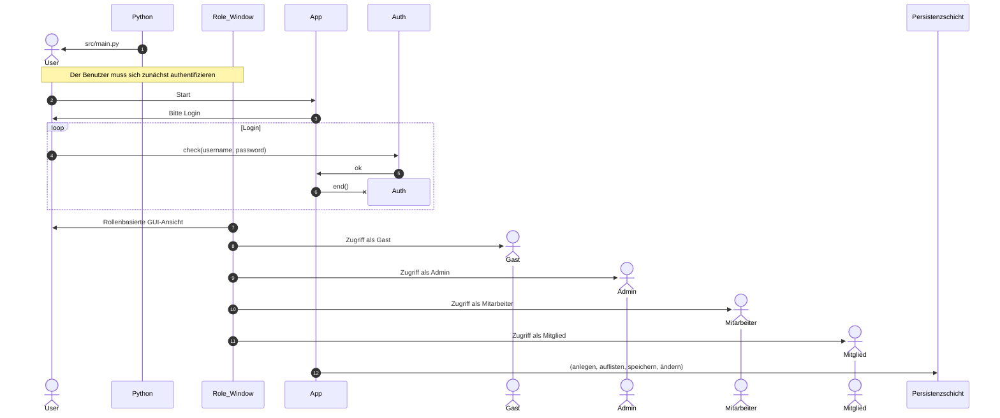
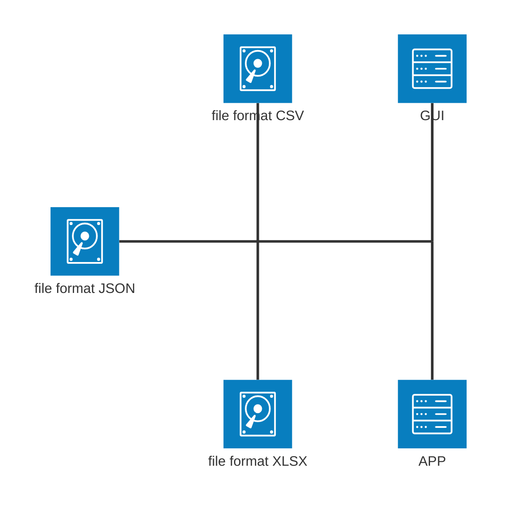
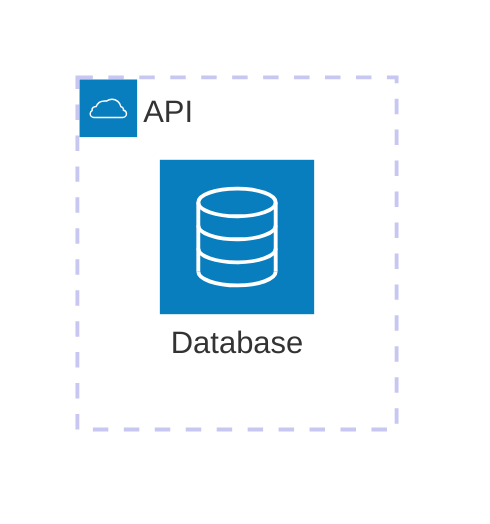
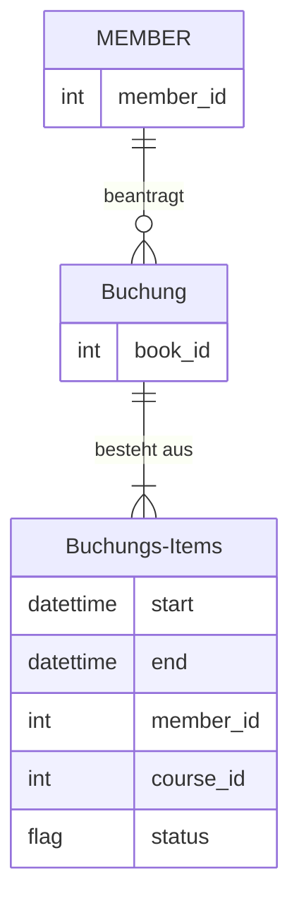
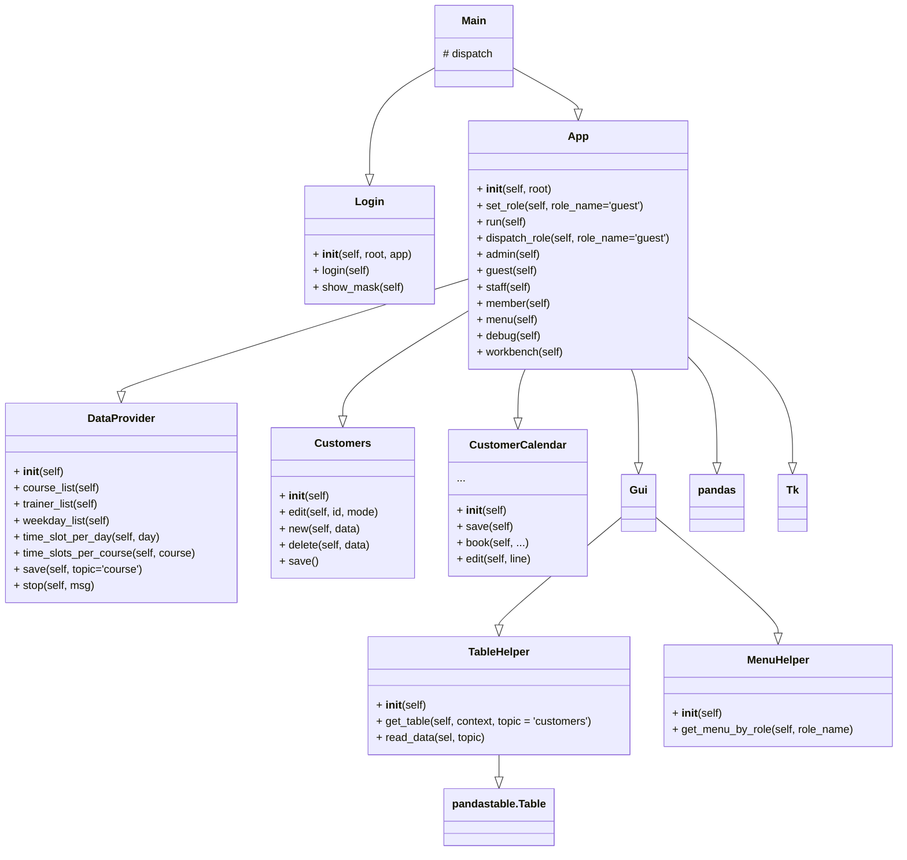

## Anwendung Sequenzdiagramm Anmeldung bis rollenbasierter GUI

## Persistenzschicht

## "Mini-ER" - Beispiel Buchung

## Klassendiagramm 

## Screenshots

## Dateistruktur

<pre><code>
.
├── customer_calendar
│   ├── README.md
│   ├── README_TOO.md
│   ├── data
│   │   ├── CalendarLog.json
│   │   ├── Kursplan.xlsx
│   │   ├── calendar_log.json
│   │   ├── course_plan.xlsx
│   │   ├── customers_database.json
│   │   ├── customers_new.json
│   │   ├── kurs.csv
│   │   ├── passwd.csv
│   │   ├── time_slot.csv
│   │   ├── trainer.csv
│   │   └── wochentag.csv
│   ├── doq
│   │   ├── admin_customer_small.png
│   │   ├── cc_doq.ipynb
│   │   └── tech_doc.md
│   ├── main.py
│   ├── requirements.txt
│   ├── src
│   │   ├── core
│   │   │   ├── __init__.py
│   │   │   ├── auth.py
│   │   │   ├── calendar_log.py
│   │   │   ├── customer_calendar.py
│   │   │   ├── customers.py
│   │   │   ├── data_provider.py
│   │   │   └── table_helper.py
│   │   ├── gui
│   │   │   ├── __init__.py
│   │   │   ├── app.py
│   │   │   ├── app_new.py
│   │   │   ├── config.py
│   │   │   ├── foo.php
│   │   │   ├── gf_gui.ipynb
│   │   │   ├── login.py
│   │   │   ├── main.py
│   │   │   ├── menu_helper.py
│   │   │   └── mitarbeit.py
│   │   ├── main.py
│   │   ├── test_dp.py
│   │   └── test_import.py
│   ├── tests
│   └── file.txt
</code></pre>

## Metriken

<pre><code>
-------------------------------------------------------------------------------
Language                     files          blank        comment           code
-------------------------------------------------------------------------------
JSON                             5              0              0           2020
Python                          23            312            100            819
Jupyter Notebook                 8              0            914            606
Markdown                         3             43              0            154
CSV                              5              0              0             44
PHP                              1              2              0              6
-------------------------------------------------------------------------------
SUM:                            45            357           1014           3649
-------------------------------------------------------------------------------
</code></pre>