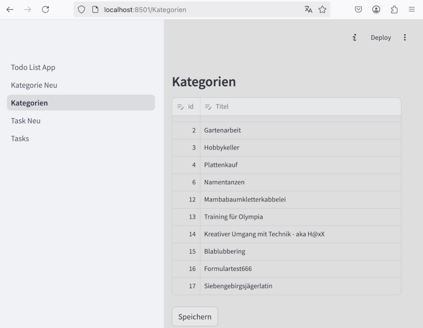

# To do list / Projektarbeit 

## Screenshots

## Filter anwenden

## Eingabeformular online

https://schrodt.nrw/task.tpl.html

## Systemumgebung

- Python
- SQLITE3
- panda 2.2.3
- Django 4.0.2 //  streamlit 1.45.0

### Online ressource

- https://blog.streamlit.io/auto-generate-a-dataframe-filtering-ui-in-streamlit-with-filter_dataframe/