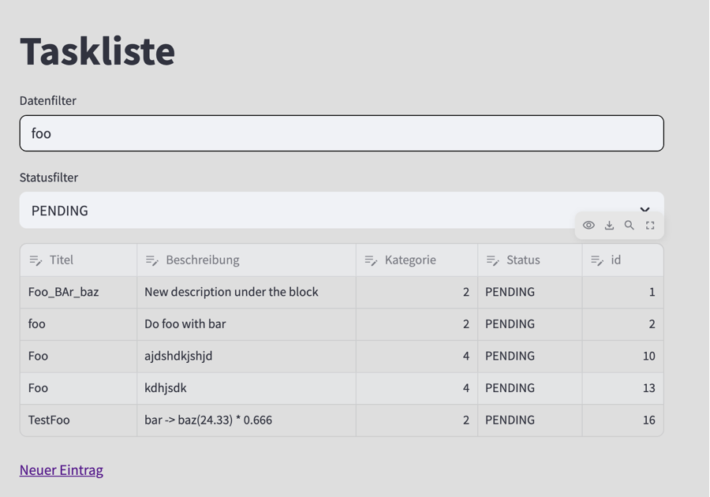

# To do list / Projektarbeit 

## Interne Links

- [Design & Architecture Dossier](/doq/dad)
- [Installation](/doq/Installation)
- [Allg. Funktionsweise Beispiel Kategorie](/doq/category)

## Screenshots

## Filter anwenden

## Systemumgebung

- Python
- SQLITE3
- panda 2.2.3
- <del>Django 4.0.2 </del>//  <ins>streamlit 1.45.0</ins>

### Online ressource

- https://blog.streamlit.io/auto-generate-a-dataframe-filtering-ui-in-streamlit-with-filter_dataframe/