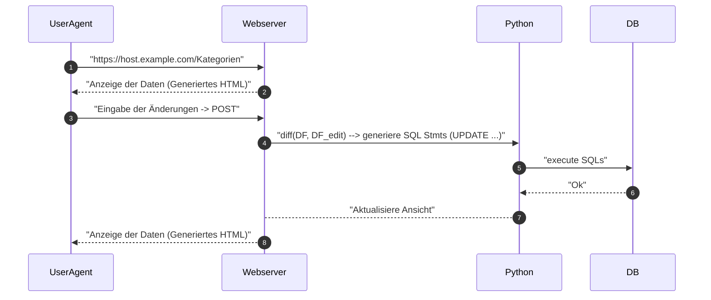
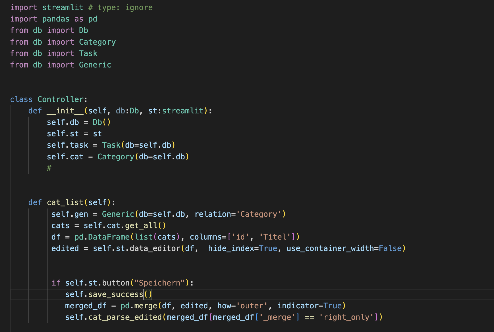
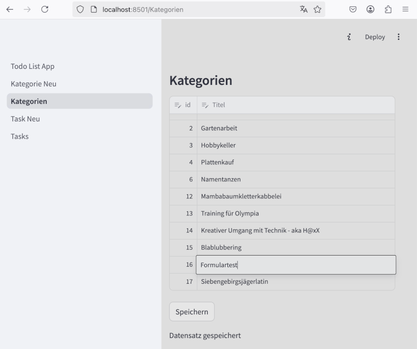
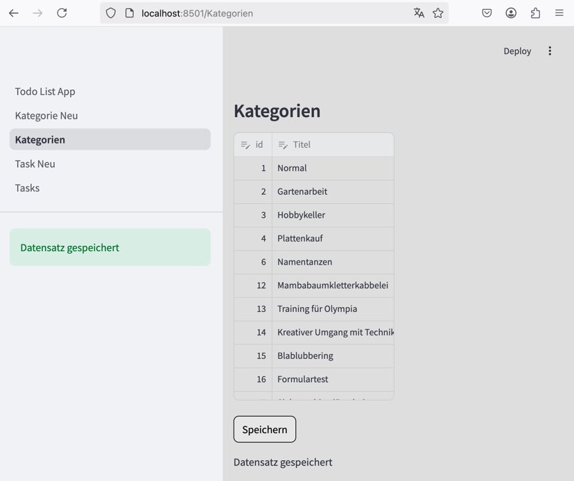

## Anwendung Sequenzdiagramm Beispiel Kategorien

```mermaid
sequenceDiagram
    autonumber
    UserAgent->>Webserver: "https://host.example.com/Kategorien"
    Webserver-->>UserAgent: "Anzeige der Daten (Generiertes HTML)" 
    UserAgent->>Webserver: "Eingabe der Änderungen -> POST"
    Webserver->>Python:  "diff(DF, DF_edit) --> generiere SQL Stmts (UPDATE ...)" 
    Python->>DB:  "execute SQLs"
    DB-->>Python: "Ok"
    Python-->Webserver: "Aktualisiere Ansicht"
    Webserver-->>UserAgent: "Anzeige der Daten (Generiertes HTML)" 
```

### <dl>
<dt>UserAgent</dt> 
<dd>HTTP-Client, z.B: Browser</dd>
</dl>

### Auschnitt Quellcode (exemplarisch für Kategorie)

## Screenshots

