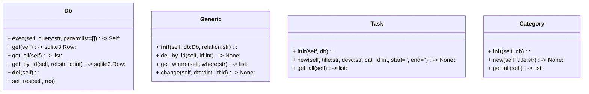

# Design & Architecture Dossier


## Persistenzschicht SQLite

- Portabel (1 Datei)
-    

## Klassen



## Datebanknmodell (Persistenzschicht)


## Filtering 

!!

## Funktionsprinzip

```mermaid
---
id: 10f759dd-b168-480d-a9ac-33191da7734a
---
sequenceDiagram
    autonumber
    create actor Server
    UserAgent->>User: src/main.py
    Note over User, Role_Window: Der Benutzer muss sich zunächst authentifizieren
    User->>App: Start # Start der Applikation
    App->>User: Bitte Login
    
    loop Login
        User->>Auth: check(username, password)
        Auth->>App: ok
        
        destroy Auth
        App-xAuth: end()
    
    end
   
    Role_Window->>User: Rollenbasierte GUI-Ansicht
    create actor G as Gast
    Role_Window->>G: Zugriff als Gast
    create actor A as Admin
    Role_Window->>A: Zugriff als Admin
    create actor S as Mitarbeiter
    Role_Window->>S: Zugriff als Mitarbeiter
    create actor M as Mitglied
    Role_Window->>M: Zugriff als Mitglied
    participant db as Persistenzschicht
    App->>db: (anlegen, auflisten, speichern, ändern)
```