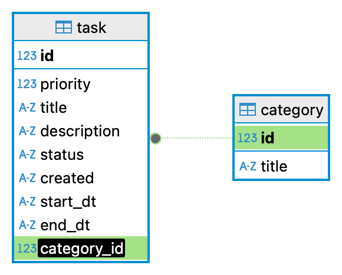

# Design & Architecture Dossier

## Klassen

```mermaid
classDiagram

    class Db{
        +  exec(self, query:str, param:list=[]) -> Self:
        +  get(self) -> sqlite3.Row:
        +  get_all(self) -> list:
        +  get_by_id(self, rel:str, id:int) -> sqlite3.Row:
        +  __del__(self):
        +  set_res(self, res)
    }

    
    class Generic{
        +  __init__(self, db:Db, relation:str):
        +  del_by_id(self, id:int) -> None:
        +  get_where(self, where:str) -> list:
        +  change(self, dta:dict, id:id) -> None:
    }

    class Task{
        +  __init__(self, db):
        +  new(self, title:str, desc:str, cat_id:int, start='', end='') -> None:
        +  get_all(self) -> list:
    }

    class Category{
        +  __init__(self, db):
        +  new(self, title:str) -> None:
        +  get_all(self) -> list:

    }
```

## Dat
