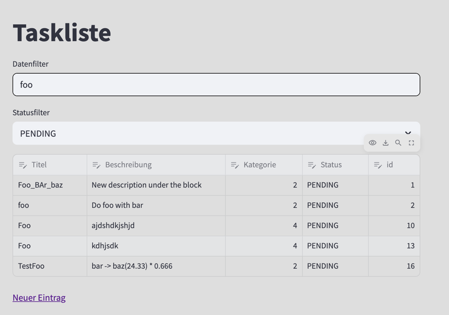
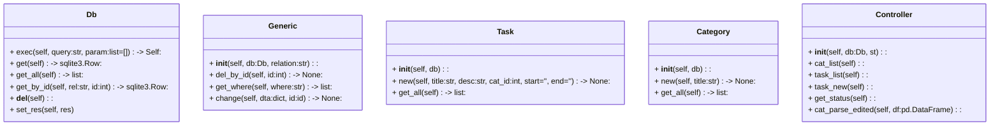

# Design & Architecture Dossier

## LOC - Lines of code

<pre>
<code>
-------------------------------------------------------------------------------
Language                     files          blank        comment           code
-------------------------------------------------------------------------------
Python                          13            180             67            343
SQL                              4              4              0            126
Markdown                         5             62              0            125
CSS                              1             23              0            112
HTML                             2             26              0             70
Text                             2              1              0             64
PHP                              1              5              0             18
Bourne Shell                     3              0              2             10
TOML                             1              2             16              7
DOS Batch                        1              0              0              1
-------------------------------------------------------------------------------
SUM:                            33            303             85            876
-------------------------------------------------------------------------------
</code>
</pre>

## Dateien

<pre>
<code>
.
├── controller.py
├── create_db.sh
├── data
│   ├── 2do_list.db
│   ├── curr_schema.sql
│   ├── current_20250514T1405.sql
│   ├── schema.sql
│   └── test.db
├── db.py
├── doq
│   ├── cat_edit.png
│   ├── cat_save.png
│   ├── cat_source_1.png
│   ├── cat.png
│   ├── category.md
│   ├── dad.md
│   ├── er.png
│   ├── filter_doppelt_klein.png
│   ├── filter_doppelt.png
│   ├── Install.md
│   ├── liste.png
│   ├── source_cat.png
│   ├── task.png
│   └── tree.txt
├── exkurs_html
│   ├── body.html
│   └── html.jpg
├── gr23.py
├── grube.py
├── LICENSE
├── main.py
├── pages
│   ├── Kategorie_Neu.py
│   ├── Kategorien.py
│   ├── sub
│   │   └── a_page.py
│   ├── Task_Neu.py
│   └── Tasks.py
├── README.md
├── req.txt
├── start.bat
├── start.sh
├── test
│   └── test_basix.py
└── Todo_List_App.py

</code>
</pre>

## Persistenzschicht SQLite

- Portabel (1 Datei)
- Einfache Syntax

### Queries
<pre>
<code>
UPDATE task SET 
    title='Fotosafari Mars mit Musk', 
    description='Nikon UND Canon einpacken', 
    status='DONE', 
    start_dt='2025-05-13', 
    end_dt='2025-05-20', 
    category_id='4' 
WHERE id=12
</code>
</pre>
## Datebanknmodell (Persistenzschicht)

## Filtering 

## Klassen
