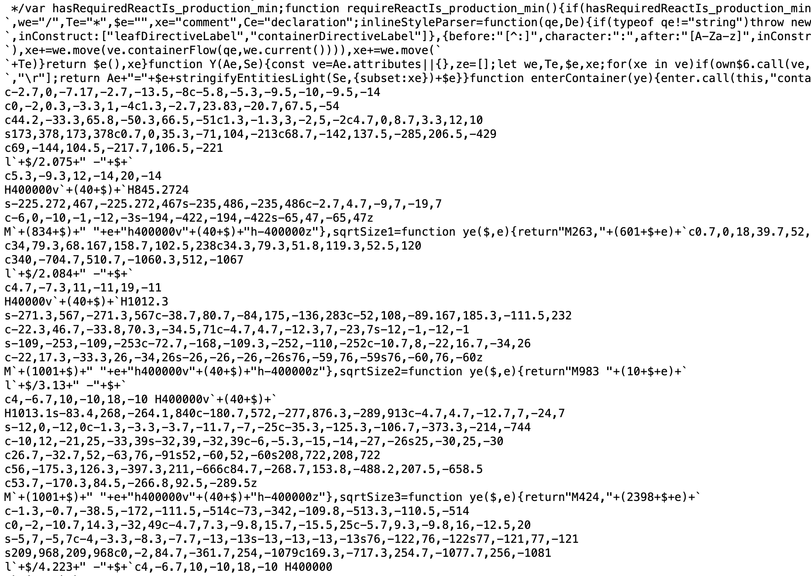
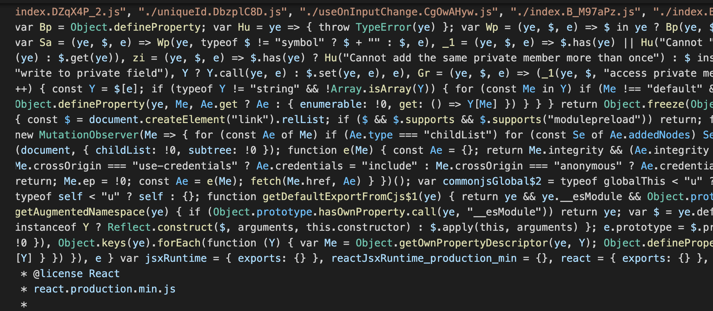

# LLM 
## Lessons learned 🙄 <small> & </small> More

-  Zwei bis drei Stunden "ausprobieren" sparen 10 Minuten Handbuch lesen 🙄

- In Pythons Web-Libs ist alles anders
        
- Python Entwickler haben eine Allergie gegen HTML/CSS
         <small>(und alles NICHT-Pythonische)</small>

      
## Wie ist das gemeint? 

# ... in VSCode

