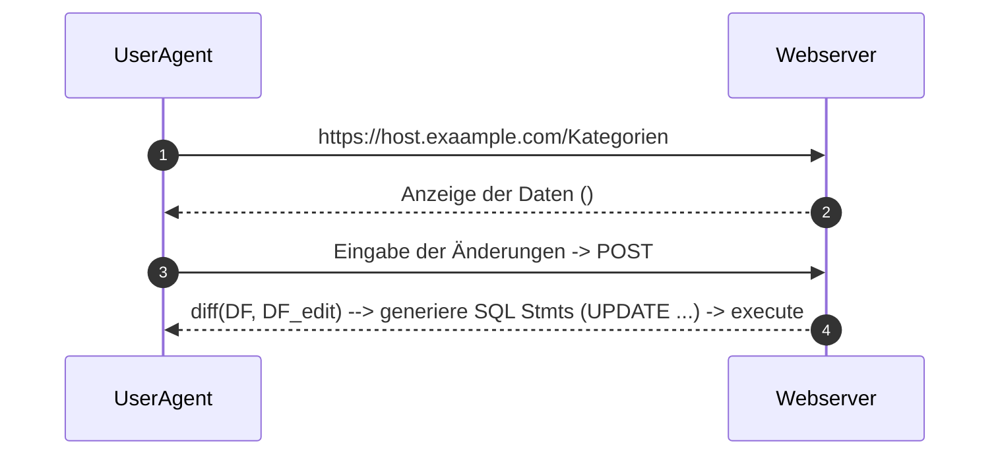

## Anwendung Sequenzdiagramm Anmeldung bis rollenbasierter GUI

```mermaid
sequenceDiagram
    autonumber
    UserAgent->>Webserver: https://host.exaample.com/Kategorien
    Webserver-->>UserAgent:  Anzeige der Daten () 
    UserAgent->>Webserver: Eingabe der Änderungen -> POST
    Webserver-->>UserAgent:  diff(DF, DF_edit) --> generiere SQL Stmts (UPDATE ...) -> execute  
```

### <dl>
<dt>UserAgent</dt> 
<dd>HTTP-Client, z.B: Browser</dd>
</dl>